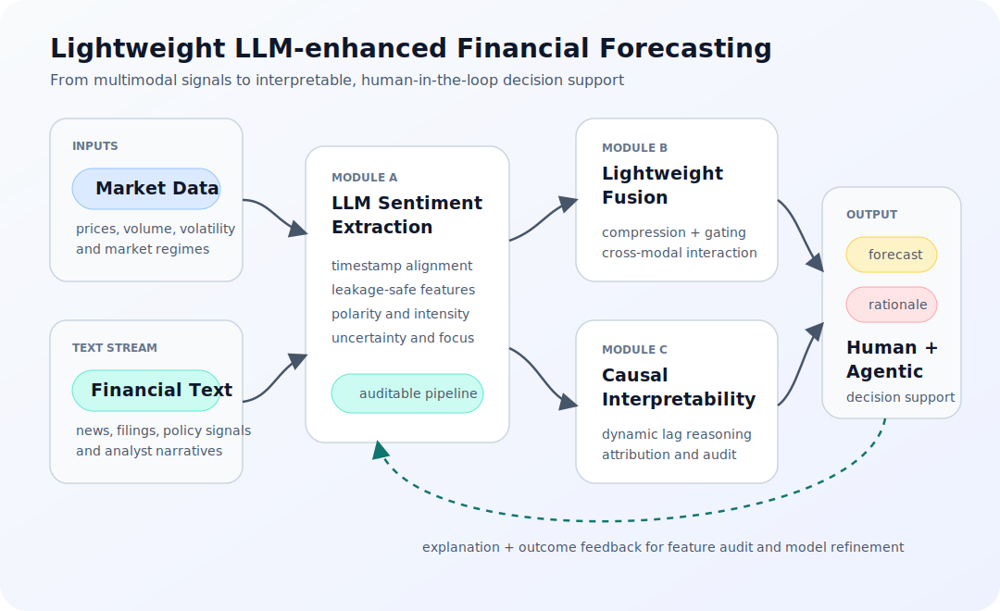

This note summarizes a manuscript I am currently developing on **lightweight LLM-enhanced sentiment fusion and causally interpretable financial time-series forecasting**.

I treat it as a **research-in-progress** piece rather than a published result. The purpose of placing it here is not to disclose the full manuscript, but to show the research question, system-level thinking, and methodological direction behind the work.

## Motivation

Financial time-series forecasting is often framed as a numerical prediction problem. A model observes historical prices, volumes, volatility patterns, and technical indicators, then predicts future return or direction.

That framing is useful, but incomplete.

In real markets, price dynamics are also shaped by news, announcements, analyst narratives, policy signals, and collective sentiment. During stable periods, price-volume patterns may contain enough information for short-horizon models. During shocks, however, purely numerical models can become fragile because the market regime changes faster than historical price relationships can adapt.

This is the core problem I want to study:

**How can financial forecasting systems incorporate textual sentiment signals without becoming too noisy, too large, or too difficult to explain?**

## Research Positioning

The manuscript is positioned at the intersection of financial machine learning, natural language processing, multimodal time-series modeling, and explainable AI.

I am not interested in simply attaching a large language model to a trading model and calling it intelligent. The more important challenge is system design.

A useful financial AI system should satisfy three requirements at the same time:

- It should extract sentiment features in a time-compliant way, avoiding look-ahead bias.
- It should fuse textual sentiment and numerical market data without allowing high-dimensional text embeddings to dominate lower-dimensional but high-signal price features.
- It should provide interpretable evidence for why a prediction was made, especially under non-stationary market conditions.

These requirements shape the manuscript's three-module architecture.

*Conceptual architecture. The manuscript is framed as a leakage-safe forecasting system that can be extended toward human-in-the-loop, agentic decision support without claiming a fully autonomous trading agent.*

## Module A: Time-compliant LLM Sentiment Extraction

The first module focuses on transforming unstructured financial text into structured sentiment features.

The key issue is not only whether an LLM can understand financial language. The key issue is whether its outputs can be used safely inside a time-series prediction pipeline.

In financial forecasting, timestamp discipline is essential. A news article, company announcement, or analyst comment can only be used if it was publicly available before the prediction decision point. Otherwise, the model may appear strong in backtests while silently using future information.

For that reason, this module emphasizes:

- timestamp alignment;
- leakage-safe feature construction;
- structured sentiment dimensions such as polarity, intensity, uncertainty, and subject focus;
- independent quality checks against human labels or financial sentiment baselines.

The goal is to turn LLM-based sentiment analysis from a loose text-mining step into an auditable feature engineering pipeline.

## Module B: Lightweight Multimodal Fusion

The second module addresses the fusion problem.

Text-derived representations are often high-dimensional, while price-volume features are comparatively compact. If these two modalities are simply concatenated, the model may overfit noisy text dimensions or allow one modality to dominate the learning process.

My manuscript explores a lightweight fusion design that treats sentiment and market data as different but interacting signals.

At a high level, the model should ask two questions:

- When market structure looks unusual, which sentiment signals help explain it?
- When sentiment becomes extreme, which price-volume patterns confirm or reject it?

This motivates a cross-modal interaction layer, supported by compression and gating mechanisms. The goal is not to build the largest possible model, but to build a model that is efficient enough for repeated financial forecasting experiments and transparent enough to analyze.

## Module C: Causal Interpretability and Dynamic Lag Reasoning

The third module focuses on interpretability.

A prediction alone is not enough in finance. A useful model should help answer what drove the prediction, whether the driver was stable, and how long the effect may persist.

This is especially important for sentiment signals. A negative policy shock, a company-specific earnings warning, and a broad macro panic may all influence prices, but their timing and persistence can differ substantially.

The manuscript therefore explores a layered interpretation framework:

- statistical evidence for whether sentiment contains incremental predictive information;
- dynamic lag reasoning to understand how sentiment effects change across market states;
- feature attribution methods that connect the model output back to sentiment and market variables.

The aim is not to claim physical causality from observational data. A more careful framing is **Granger-style predictive causality and decision-relevant attribution** under time-series constraints.

## Why This Matters

This research direction matters because many financial AI systems fail at the boundary between prediction and decision.

A model can achieve a promising validation score and still be unusable if it relies on leaked information, cannot handle regime shifts, or cannot explain its behavior to a risk-aware decision maker.

By combining leakage-safe LLM sentiment extraction, lightweight multimodal fusion, and causally informed interpretability, this manuscript attempts to move toward financial forecasting systems that are not only more accurate, but also more reliable, auditable, and decision-relevant.

## Current Status

This work is currently in manuscript development and submission preparation. The public note intentionally omits the full mathematical formulation, implementation details, hyperparameter settings, data access procedures, and experimental tables.

Those details belong in the manuscript itself. For this portfolio, the most important signal is the research direction: using AI to build financial decision systems that can reason across text, time, uncertainty, and explanation.
